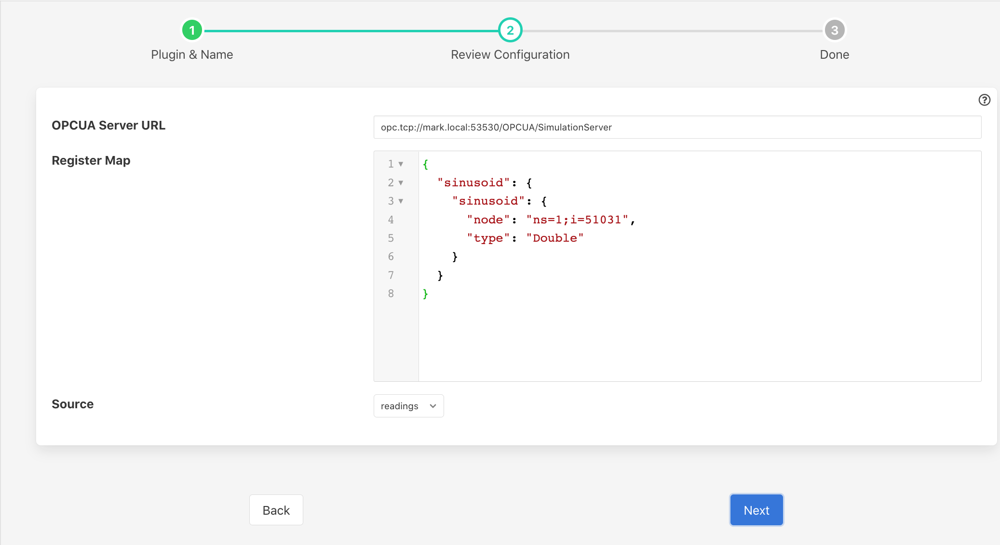
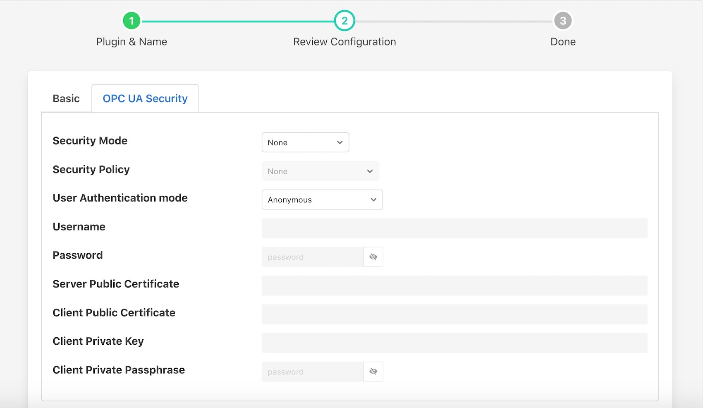
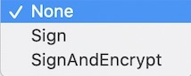
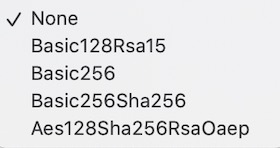
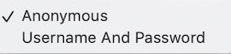
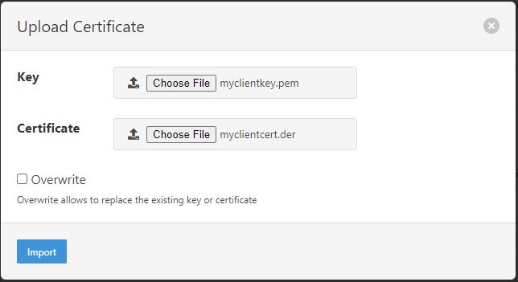

.. Images

.. Links

.. |OpenSSL| raw:: html

    <a href="https://www.openssl.org">OpenSSL</a>

.. |generate_certificate| raw:: html

    <a href="https://github.com/FreeOpcUa/opcua-asyncio/blob/master/examples/generate_certificate.sh">generate certificates</a>

.. |FreeOpcUa| raw:: html

    <a href="https://github.com/FreeOpcUa/opcua-asyncio">FreeOpcUa python library</a>

.. |filter-asset| raw:: html

   <a href="../fledge-filter-asset/index.html">Asset Filter</a>

North OPC UA Client
===================

The *fledge-north-opcuaclient* is a python based OPC UA Client plugin for Fledge that sends data north to an OPC UA Server.

The plugin may be used within a north *task* or *service*. Both of these are created via the *North* menu item in the Fledge user interface.

  - Select *North* from the left hand menu bar

  - Click on the + icon in the top left

  - Choose *opcuaclient* from the plugin selection list

  - Name your task or service

  - Select if you wish to create a service otherwise by default task

  - Click on *Next*

  - Configure the plugin

The configuration parameters that can be set on this page are divided into a set of tabs;

  - Basic Configuration

  - OPC UA Security

The basic configuration tab is shown below

  +---------------------+
  | |opcuaclient_basic| |
  +---------------------+

On this tab a number of configuration parameters are available;

      - **OPC UA Server URL**: The url of the OPC UA Server to which data will be sent. The URL should be of the form opc.tcp://...

      - **Map**: A map for asset datapoints/attributes to OPC UA node objects. A map JSON structure in which the outer names are Asset names and the inner names are Datapoint names.

      Below are the various JSON examples:

      a) When reading block is having with an asset and a single datapoint then map should be as follows:

        .. code-block:: JSON

            {
                "sinusoid": {
                    "sinusoid": {
                        "node": "ns=3;i=1017",
                        "type": "Float"
                    }
                }
            }

        - sinusoid is an asset name
        - sinusoid is a datapoint name

      b) When reading block is having with an asset and multiple datapoints then map should be as follows:

        .. code-block:: JSON

            {
                "sinusoid": {
                    "random": {
                        "node": "ns=3;i=1017",
                        "type": "Float"
                    },
                    "sawtooth": {
                        "node": "ns=3;i=1018",
                        "type": "Double"
                    }
                }
            }

        - sinusoid is an asset name
        - random and sawtooth are the datapoints name

      c) When reading block is having with multiple assets and single datapoint then map should be as follows:

        .. code-block:: JSON

            {
                "sensorDevice": {
                    "name": {
                        "node": "ns=3;i=1019",
                        "type": "String"
                    }
                },
                "sensorTag": {
                    "green_light": {
                        "node": "ns=3;i=1008",
                        "type": "Boolean"
                    }
                }
            }

        - sensorDevice and sensorTag are the assets name
        - name and green_light are the datapoints name

      - **Source**: The source of the data to be sent, this may be the *readings* or *statistics* data.

The OPC UA Security tab contains a set of configuration items that is used for setting the security between the client and the OPC UA Server.

+------------------------+
| |opcuaclient_security| |
+------------------------+

  - **Security Mode**: Specify the OPC UA security mode that will be used to communicate with the OPC UA server.

    +-----------------+
    | |security_mode| |
    +-----------------+

  - **Security Policy**: Specify the OPC UA security policy that will be used to communicate with the OPC UA server.

    +-------------------+
    | |security_policy| |
    +-------------------+

  - **User Authentication Mode**: Specify the user authentication mode that will be used when authenticating the connection to the OPC UA server.

    +----------------------------+
    | |user_authentication_mode| |
    +----------------------------+

  - **Username**: Specify the username to use for authentication. This is only used if the *User Authentication Mode* is set to *Username And Password*.

  - **Password**: Specify the password to use for authentication. This is only used if the *User Authentication Mode* is set to *Username And Password*.

  - **Server Public Certificate**: (Optional) The name of the public certificate of the OPC UA server specified in the *OPC UA Server URL*. This must either be a DER or PEM format certificate file.

  - **Client Public Certificate**: The name of the public certificate of the OPC UA client application, that is, this plugin. This must either be a DER or PEM format certificate file.

  - **Client Private Key**: The name of the private key of the client application, that is, the private key the plugin will use. This must be a PEM format key file.

  - **Client Private Passphrase Key**: If the private key has a passphrase, enter it here. Otherwise leave it blank.

.. note::
    For all certificates and keys, you must include the file extension (myclientcert.der or myclientkey.pem). Do not include the file's directory name.

- Click *Next*

- Enable your task or service

- Click *Done*

Certificate Management
----------------------

Typically a Certificate Authority issues a client certificate and private key for the plugin which are imported into the Fledge Certificate Store along with a certificate from the OPC UA server.
It is also possible to use self-signed certificates. In all cases, the system manager **must** copy the server certificate to the Fledge Certificate Store and the client certificate to the server's trusted certificate store. Do not copy the client private key to any other system.

|OpenSSL| may be used to generate and convert the keys and certificates required.
An example to |generate_certificate| to do this is available as part of the underlying |FreeOpcUa|. Copy the ssl.conf file in this example to your own system when using the OpenSSL commands below to generate certificates.

.. note::
    subjectAltName **must** include your OPC UA server Application URI. This URI can be created in the client certificate by setting the value of the URI token in subjectAltName in the ssl.conf file.

Use the OpenSSL command-line utility to generate the certificate and key files to the formats needed for the Plugin.

.. code-block:: bash

   openssl genrsa -out myclientkey.pem 2048

   openssl req -x509 -days 365 -new -out myclientcert.pem -key myclientkey.pem -config ssl.conf

   openssl x509 -outform der -in myclientcert.pem -out myclientcert.der

Importing the Certificate and Key Files
~~~~~~~~~~~~~~~~~~~~~~~~~~~~~~~~~~~~~~~
You can either use Fledge GUI or manually to upload the certificates at right place.

a) Using the Fledge GUI (Recommended way)

- Launch the Fledge GUI.
- Navigate to the Certificate Store.
- In the upper right corner of the screen, click *Import*.

    +-------------+
    | |certstore| |
    +-------------+

    - In the *Key* section, click *Choose File* and navigate to the location of the key file *myclientkey.pem*.

    - In the *Certificate* section, click *Choose File* and navigate to the location of the certificate file *myclientcert.der*.

    - Click *Import*.

And for the OPC UA server certificate, enter the server certificate file name in the *Certificate* portion of the Import dialog and then click *Import*.

b) Manually

- Copy the certificates and place in the `$FLEDGE_DATA/etc/certs/` or `$FLEDGE_ROOT/data/etc/certs/` directory. If the certificate is in PEM format, place it in the `$FLEDGE_DATA/etc/certs/pem/` or `$FLEDGE_ROOT/data/etc/certs/pem/` directory.
- Copy the key and place in the `$FLEDGE_DATA/etc/certs/` or `$FLEDGE_ROOT/data/etc/certs/` directory.

Known Issue
~~~~~~~~~~~

If we need to selectively send readings out based on its configuration, you may see the Egress counter for the corresponding service will still include all the readings that have been pulled by the north service.

For the north based plugin, we would normally not remove readings in the north plugin, but rather in a filter.

It is recommended to attach a filter on the north service, to exclude the readings that are not going to be sent out.
One may use a filter like |filter-asset|, to do such filtering beforehand.

