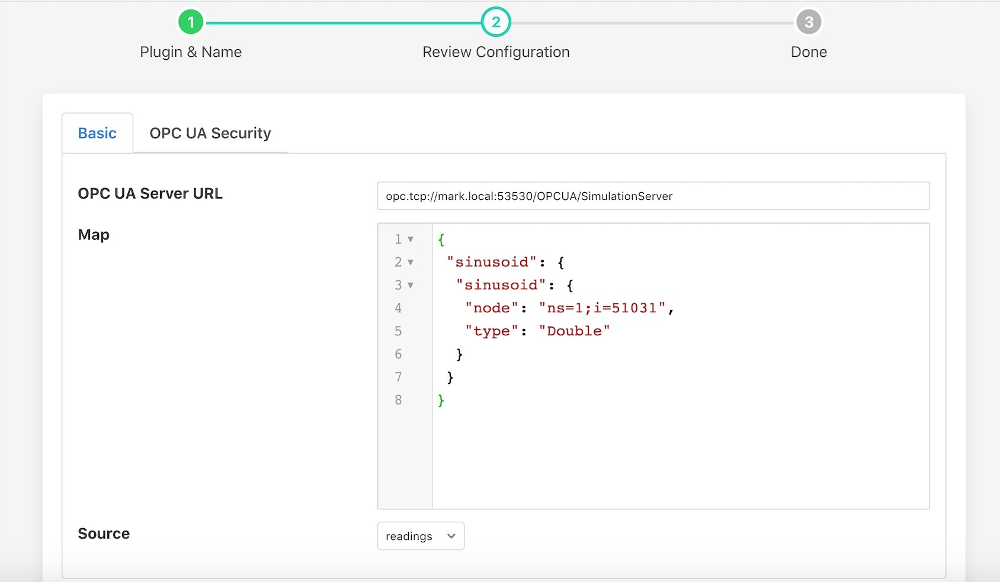

.. Images

North OpcuaClient
=================

The *fledge-north-opcuaclient* plugin allows data to be sent with an OPC UA Client to a OPC UA Server.

The plugin may be used within a north *task* or *service*. Both of these are created via the *North* menu item in the Fledge user interface.

  - Select *North* from the left hand menu bar

  - Click on the + icon in the top left

  - Choose *opcuaclient* from the plugin selection list

  - Name your service

  - Select if you wish to create a task or a service

  - Click on *Next*

  - Configure the plugin

  +-----------------+
  | |opcuaclient_1| |
  +-----------------+

      - **OPCUA Server URL**: The url of the OPC UA Server from which data will be extracted. The URL should be of the form opc.tcp://...

      - **Register Map**: The register map defines which are set of locations in the OPC UA object hierarchy.

      - **Source**: The source of the data to be sent, this may be the *readings* or *statistics* data.

  - Click *Next*

  - Enable your task or service and click *Done*

